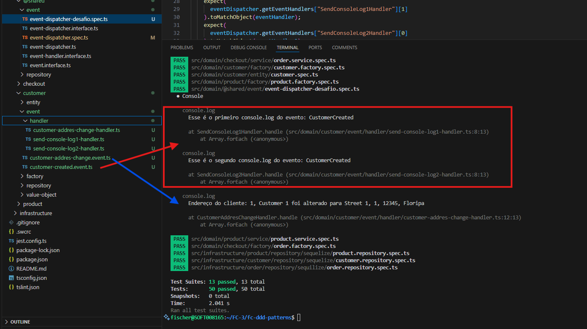

# Full Cycle 3.0: DDD - Modelagem Tática e Patterns

Bem-vindo ao repositório da aula sobre **DDD: Modelagem Tática e Patterns** do curso Full Cycle 3.0.

## Objetivo

O objetivo desta aula é ensinar como aplicar técnicas de modelagem tática do DDD, utilizando patterns conhecidos para criar um design de software mais eficaz e alinhado ao domínio do problema.

## Estrutura do Projeto

O projeto está dividido em módulos, cada um representando uma parte específica da modelagem tática do DDD. Abaixo está a estrutura básica do projeto:

```bash
fc-ddd-patterns/
├── src/
│   ├── domain/
│   │   ├── entities/
│   │   ├── value-objects/
│   │   ├── repositories/
│   │   ├── services/
│   │   ├── aggregates/
│   │   └── events/
│   ├── application/
│   ├── infrastructure/
│   └── presentation/
├── tests/
└── README.md
```

## Requisitos

- Node.js
- TypeScript

## Instalação

Para instalar as dependências do projeto, execute o seguinte comando:

```bash
npm install
```

## Executando os Testes

Para executar os testes do projeto, utilize o comando abaixo:

```bash
npm test
```

## Desafio de Repositório
Nesse desafio você deverá fazer com que a classe OrderRepository implemente totalmente os métodos definidos pelo OrderRepositoryInterface. Toda essa implementação deverá ser reproduzida através de testes.
Após realizar tal implementação submeta seu projeto, nesse ponto todos os testes devem estar passando.
Boa sorte.
A linguagem de programação para este desafio é TypeScript

## Desafio Domain Events

Agora que você já possui a base sobre Domain Events, implemente dois Eventos de Domínio para o agregado de Customer.

O primeiro evento deverá acontecer quando um novo Customer é criado. Nesse ponto, crie 2 handlers exibindo um "console.log". 

Handler1: EnviaConsoleLog1Handler. Mensagem: "Esse é o primeiro console.log do evento: CustomerCreated".
Handler2: EnviaConsoleLog2Handler. Mensagem: "Esse é o segundo console.log do evento: CustomerCreated". 
O segundo evento deverá ser disparado quando o endereço do Customer é trocado (método changeAddress()). Nesse caso, o ID, Nome, bem como os dados do endereço devem ser passados ao evento.

Handler: EnviaConsoleLogHandler. Mensagem: "Endereço do cliente: {id}, {nome} alterado para: {endereco}".
Todos os testes devem ser realizados para garantir o bom funcionamento dos eventos.

### Eventos de Domínio CustomerCreatedEvent: Evento disparado quando um novo Customer é criado. 
Handler:
- SendConsoleLog1Handler
- SendConsoleLog2Handler

### Eventos de Domínio CustomerAddressChangedEvent: Evento disparado quando o endereço de um Customer é alterado.
Handler:
- CustomerAddresChangeHandler

### Testes: event-dispatcher-desafio.spec.ts




